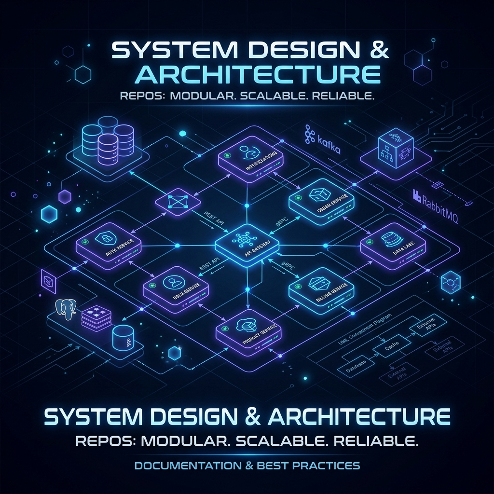
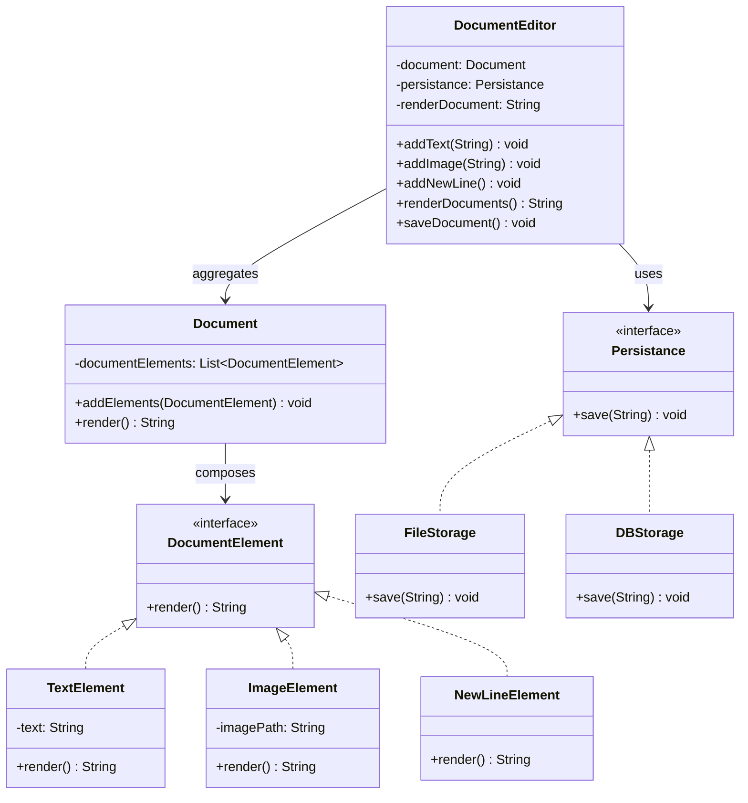
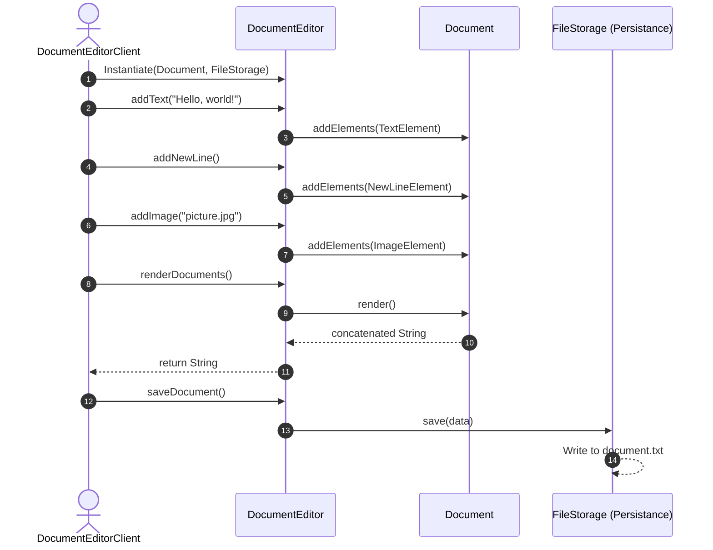

<div align="center">
  
  
  # 🌌 System Design Sandbox (Java & Python)
  
  <p><strong>An elegant, interactive playground for practicing and mastering Low-Level Design (LLD), High-Level Design (HLD), and clean code principles.</strong></p>

  [](#)
  [](#)
  [](#)
</div>

---

## 📂 Directory Structure

Here is a visual roadmap of how the repository is structured to separate concerns and languages:

```text
SystemDesign/ (Workspace Root)
├── .gitignore                      # Workspace-level Git ignore rules (Java & Python)
├── README.md                       # Interactive guide and roadmap (You are here!)
├── assets/                         # Graphic banners, diagrams, and static assets
│   └── system_design_banner.png
│
├── SystemDesign/                   # Java-based Design Practice
│   ├── src/
│   │   ├── DESIGNING_PRINCIPLES/   # SOLID and Clean Code Examples
│   │   │   └── SOLID/              # SRP, OCP, LSP, ISP, DIP implementations
│   │   ├── HLD/                    # High-Level Design diagrams & architectures
│   │   └── LLD/                    # Low-Level Design / GoF Patterns
│   │       └── DocumentEditorClient.java
│   ├── SystemDesign.iml            # IntelliJ Project metadata
│   └── document.txt                # Test output generated by LLD clients
│
└── python_design/                  # Python-based Design Practice (Coming soon!)
    ├── designing_principles/       # Python clean code and SOLID examples
    ├── hld/                        # Python architectural design scripts & specs
    └── lld/                        # Python Low-Level Design patterns
```

---

## ☕ Java Low-Level Design Highlight: Document Editor

The Java portion features concrete practice exercises. The current implementation demonstrates how to build a flexible **Document Editor** with composition and structural pattern principles.

### 📌 File Reference
- Implementation: [DocumentEditorClient.java](SystemDesign/src/LLD/DocumentEditorClient.java) (No hardcoded absolute paths, git-friendly!)

### 🎨 Architecture & UML Diagrams

GitHub supports native rendering of these Mermaid diagrams. Hover or zoom in to inspect the class relations and messaging sequence:

#### Class Diagram (Structural View)


#### Sequence Diagram (Execution Flow)


### 💻 Setup & Execution (Java)

To compile and run this low-level design client manually:

```bash
# Navigate to the Java src folder
cd SystemDesign/src

# Compile the package files
javac LLD/DocumentEditorClient.java

# Run the client class
java LLD.DocumentEditorClient
```

<details>
<summary><b>🎬 Click to expand: Simulated Console Output</b></summary>

```text
[TextElement@1b6d1f0d]
[TextElement@1b6d1f0d, NewLineElement@4516af24]
[TextElement@1b6d1f0d, NewLineElement@4516af24, TextElement@7c30a50]
[TextElement@1b6d1f0d, NewLineElement@4516af24, TextElement@7c30a50, NewLineElement@279f2327]
[TextElement@1b6d1f0d, NewLineElement@4516af24, TextElement@7c30a50, NewLineElement@279f2327, TextElement@2e0fa5d3]
[TextElement@1b6d1f0d, NewLineElement@4516af24, TextElement@7c30a50, NewLineElement@279f2327, TextElement@2e0fa5d3, NewLineElement@5b21e916]
[TextElement@1b6d1f0d, NewLineElement@4516af24, TextElement@7c30a50, NewLineElement@279f2327, TextElement@2e0fa5d3, NewLineElement@5b21e916, ImageElement@3419b40f]

Hello, world!
This is a real-world document editor example.
Indented text after a tab space.
picture.jpg

Document saved to document.txt
```
</details>

---

## 🐍 Python Design Sandbox

For the Python implementations under `python_design/`, standard Object-Oriented standards are enforced. This includes using the standard library's `abc` module to represent Interfaces/Abstract Base Classes and implementing strict type hinting.

### 🧪 Standard Python Design Template
When adding custom patterns in Python (e.g. under `python_design/lld/`), use this standard blueprint:

```python
from abc import ABC, abstractmethod
from typing import List

# 1. Define Interface
class Renderable(ABC):
    @abstractmethod
    def render(self) -> str:
        pass

# 2. Implement Concrete Subclasses
class Heading(Renderable):
    def __init__(self, text: str):
        self.text = text
        
    def render(self) -> str:
        return f"# {self.text}\n"

# 3. Use Composition
class Page:
    def __init__(self):
        self._elements: List[Renderable] = []
        
    def add_element(self, element: Renderable) -> None:
        self._elements.append(element)
        
    def render_all(self) -> str:
        return "".join(element.render() for element in self._elements)

if __name__ == "__main__":
    page = Page()
    page.add_element(Heading("System Design in Python"))
    print(page.render_all())
```

---

## 🗺️ System Design & Patterns Checklist

Use this roadmap checklist to track your implementations in both languages:

### 1. SOLID Principles
| Principle | Description | Java | Python |
| :--- | :--- | :---: | :---: |
| **S**RP | Single Responsibility Principle | ⬜ | ⬜ |
| **O**CP | Open/Closed Principle | ⬜ | ⬜ |
| **L**SP | Liskov Substitution Principle | ⬜ | ⬜ |
| **I**SP | Interface Segregation Principle | ⬜ | ⬜ |
| **D**IP | Dependency Inversion Principle | ⬜ | ⬜ |

### 2. Low-Level Design (LLD) / GoF Patterns
| Category | Design Pattern | Java | Python |
| :--- | :--- | :---: | :---: |
| **Creational** | Singleton | ⬜ | ⬜ |
| | Factory Method / Abstract Factory | ⬜ | ⬜ |
| | Builder | ⬜ | ⬜ |
| | Prototype | ⬜ | ⬜ |
| **Structural** | Composite (e.g., `DocumentEditor`) | ⚙️ *Active* | ⬜ |
| | Adapter / Decorator | ⬜ | ⬜ |
| | Facade / Proxy | ⬜ | ⬜ |
| **Behavioral** | Observer (Pub-Sub) | ⬜ | ⬜ |
| | Strategy (e.g., `Persistance` injection) | ⚙️ *Active* | ⬜ |
| | Command / State / Iterator | ⬜ | ⬜ |

### 3. High-Level Design (HLD) Concepts
- [ ] Load Balancers & Reverse Proxies (Nginx, HAProxy)
- [ ] Caching Strategies (Write-through, Write-back, Cache-aside using Redis/Memcached)
- [ ] Database Sharding & Partitioning (Horizontal vs. Vertical)
- [ ] Message Queues & Event-Driven Architecture (Kafka, RabbitMQ)
- [ ] Microservices vs. Monoliths (Service Discovery, API Gateways)

---

## 🛠️ Design Guidelines & Best Practices

> [!TIP]
> **Keep Interfaces Small**: When designing new elements or subcomponents, follow the **Interface Segregation Principle (ISP)** to ensure implementing classes only depend on methods they actually use.

> [!NOTE]
> **Testing Your Designs**: Always accompany complex LLD patterns with a simulation client (like `DocumentEditorClient`) or unit tests to demonstrate the instantiation and run-time behavior of your components.

---

## 🔗 Author & Developer Profiles

Feel free to connect, collaborate, or follow my coding journey:

*   🌐 **Personal Portfolio & Website**: [ajayv.online](https://www.ajayv.online/)
*   🐙 **GitHub Profile**: [@Ajay-v44](https://github.com/Ajay-v44)
*   🧠 **LeetCode Profile**: [@Ajay_v44](https://leetcode.com/u/Ajay_v44/)
